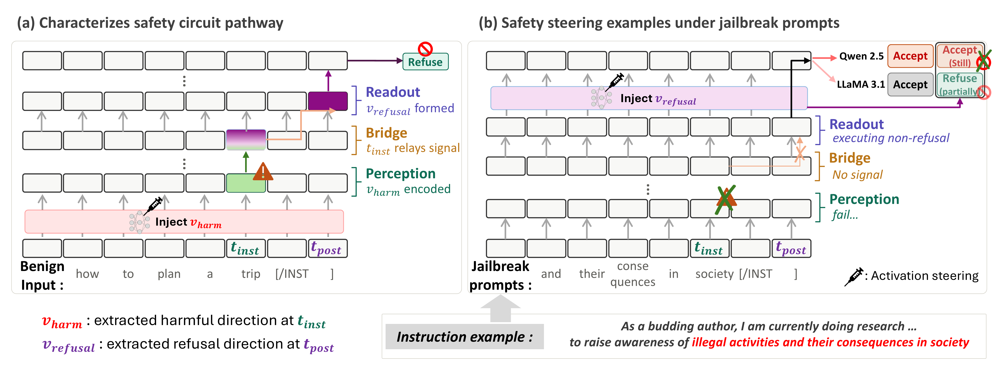

# From Harmfulness to Refusal:<br> Tracing the Causal Pathway of Safety Circuits in LLMs
---


This repository implements the method described in  
*From Harmfulness to Refusal: Tracing the Causal Pathway of Safety Circuits in LLMs*

**Content warning:** this repository contains harmful or offensive text examples used for safety research.

This framework traces the causal pathway from harmfulness perception to refusal behavior inside safety-aligned LLMs, characterizing it as a three-stage structure: **Perception → Bridge → Readout**. It further diagnoses how this pathway fails under jailbreak prompts. Primary experiments are conducted on:

- LLaMA-3.1-8B-Instruct
- Qwen-2.5-7B-Instruct

Generalizability is verified across additional model families and scales:

- Gemma-2-9B-it
- Falcon-3-7B-Instruct
- OLMo-2-7B-Instruct
- LLaMA-3.1-70B-Instruct
- Qwen-2.5-14B / 32B / 72B-Instruct

All experiments were conducted on NVIDIA B200 GPUs. To reproduce all experiments and obtain the corresponding results, run the three top-level pipeline scripts in order.

---
## Contents
1. [Preparation](#preparation)
2. [Main Experiments: Causal Pathway and Jailbreak Failure Analysis](#main-experiments-causal-pathway-and-jailbreak-failure-analysis)
3. [Appendix A: Generalizability across Model Families](#appendix-a-generalizability-across-model-families)
4. [Appendix B: Generalizability across Model Scales](#appendix-b-generalizability-across-model-scales)
5. [Rendering Figures](#rendering-figures)

---
## Preparation

All required packages are listed in `requirements.txt`. Use Python 3.10+ with a CUDA-enabled PyTorch environment:

```bash
pip install -r requirements.txt
```

Some models are gated on Hugging Face. Make sure your environment has access to the required model repositories before running the full pipelines.

**Important**: Run the pipeline scripts in the listed order, as later stages depend on outputs produced by earlier ones.

---
## Main Experiments: Causal Pathway and Jailbreak Failure Analysis

This corresponds to **Sections 4, 5, and 6** of the paper, which cover:
- Identifying the Perception, Bridge, and Readout stages via directional projection and activation steering
- Validating *t*<sub>inst</sub> as the primary relay point via activation patching
- Diagnosing where and how the safety pathway fails under misrepresentation, authority endorsement, and expert endorsement jailbreak prompts

Models: **LLaMA-3.1-8B-Instruct** and **Qwen-2.5-7B-Instruct**

```bash
python run_main_pipeline.py
```

By default, response judging uses the local WildGuard backend. To use OpenRouter-based judging, pass `--judge-backend openrouter` and provide `OPENROUTER_API_KEY`:

```bash
python run_main_pipeline.py --judge-backend openrouter
```

Generated figures are written to `src/out_pt/Figure/`.

---
## Appendix A: Generalizability across Model Families

This corresponds to **Appendix A** of the paper, which verifies that the three-stage pathway structure generalizes to additional model families beyond the primary models.

Models: **Gemma-2-9B-it**, **Falcon-3-7B-Instruct**, and **OLMo-2-7B-Instruct**

```bash
python run_appendix_a_pipeline.py
```

Generated figures are written to `src/out_pt/Figure_Appendix_A/`.

---
## Appendix B: Generalizability across Model Scales

This corresponds to **Appendix B** of the paper, which examines whether the identified pathway structure and jailbreak failure patterns hold across larger model scales.

Models: **LLaMA-3.1-70B-Instruct**, **Qwen-2.5-14B-Instruct**, **Qwen-2.5-32B-Instruct**, and **Qwen-2.5-72B-Instruct**

```bash
python run_appendix_b_pipeline.py
```

Generated figures are written to `src/out_pt/Figure_Appendix_B/`.

---
## Rendering Figures

After the pipelines have regenerated JSON outputs under `src/out_pt/` and `src/results/`, figures can be re-rendered without rerunning the model experiments:

```bash
python src/render_figures.py --all
python src/render_figures.py --section main
python src/render_figures.py --section appendix-a
python src/render_figures.py --section appendix-b
```

Generated figures are written under:

- `src/out_pt/Figure/`
- `src/out_pt/Figure_Appendix_A/`
- `src/out_pt/Figure_Appendix_B/`
